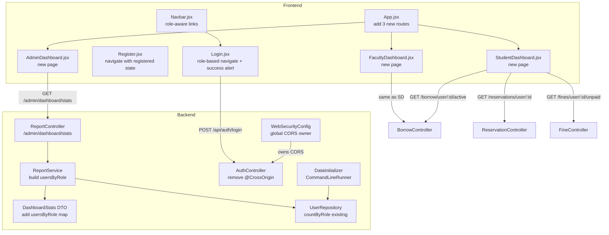

# Design Document: auth-dashboard-fix

## Overview

This feature patches five interconnected gaps in the SLIIT Online Library Management System: empty database on first boot, a duplicate CORS annotation that conflicts with the global Spring Security policy, missing registration-success feedback, hard-coded post-login navigation that ignores the user's role, and absent role-specific dashboards for Admin, Student, and Faculty users. The changes span three backend files and seven frontend files, with no schema migrations required because the User table already contains all needed columns.

## Architecture



## Component / File Change Table

| Wave | File | Change Type | Purpose |
|------|------|-------------|---------|
| 0 | `backend/…/config/DataInitializer.java` | New | Seed 4 default users on empty DB |
| 0 | `backend/…/controller/AuthController.java` | Edit (1 line) | Remove `@CrossOrigin` annotation |
| 0 | `backend/…/dto/DashboardStats.java` | Edit | Add `usersByRole` map field |
| 0 | `backend/…/service/ReportService.java` | Edit | Populate `usersByRole` in `getDashboardStats()` |
| 1 | `frontend/src/pages/Login.jsx` | Edit | Role-based redirect + success alert |
| 1 | `frontend/src/pages/Register.jsx` | Edit | Pass `{ registered: true }` state to `/login` |
| 1 | `frontend/src/pages/AdminDashboard.jsx` | New | Admin-only stats + quick links |
| 1 | `frontend/src/pages/StudentDashboard.jsx` | New | Student loans/reservations/fines |
| 1 | `frontend/src/pages/FacultyDashboard.jsx` | New | Faculty dashboard with policy card |
| 2 | `frontend/src/App.jsx` | Edit | Register 3 new protected routes |
| 2 | `frontend/src/components/Navbar.jsx` | Edit | Role-aware navigation links |

---

## Detailed Design

### Wave 0 — Backend

#### DataInitializer.java (new)

**Location:** `backend/src/main/java/com/sliit/library/config/DataInitializer.java`

Implements `CommandLineRunner`. Spring Boot calls `run()` once after the application context is ready. The method checks `userRepository.count() == 0`; if the table is empty it saves four users via `User.builder()`.

```
Seed users:
  admin@example.com     role=ADMIN      fullName="System Admin"       studentStaffId="ADMIN001"   phone="0771234567"
  librarian@example.com role=LIBRARIAN  fullName="Head Librarian"     studentStaffId="LIB001"     phone="0771234568"
  student@example.com   role=STUDENT    fullName="Demo Student"       studentStaffId="IT12345678" phone="0771234569" faculty="Computing" programme="BSc IT"
  faculty@example.com   role=FACULTY    fullName="Demo Faculty"       studentStaffId="FAC001"     phone="0771234570" faculty="Computing"

All users: isActive=true, currentBorrowCount=0, outstandingFine=0.0
Passwords: encoder.encode("password")
```

Dependencies injected: `UserRepository`, `PasswordEncoder` (already declared as `@Bean` in `WebSecurityConfig`).

#### AuthController.java (edit — 1 line removed)

Remove the `@CrossOrigin(origins = "*", maxAge = 3600)` annotation on the class. CORS is already handled globally by `WebSecurityConfig.corsConfigurationSource()`, which reads `cors.allowed-origins` from `application.properties` and allows `http://localhost:5173` and `http://localhost:3000` with credentials. Keeping the controller-level annotation creates a conflict where browsers receive duplicate or inconsistent CORS headers.

#### DashboardStats.java (edit — add field)

Add one field to support the Admin Dashboard user-by-role breakdown:

```java
private Map<String, Long> usersByRole;   // keys: "STUDENT", "FACULTY", "LIBRARIAN", "ADMIN"
```

The existing `totalStudents` and `totalFaculty` fields are retained for backwards-compatibility with the existing Librarian Dashboard.

#### ReportService.java (edit — populate new field)

Inside `getDashboardStats()`, build and attach the `usersByRole` map using the already-available `userRepository.countByRole(Role)`:

```
usersByRole = Map.of(
    "STUDENT",   userRepository.countByRole(Role.STUDENT),
    "FACULTY",   userRepository.countByRole(Role.FACULTY),
    "LIBRARIAN", userRepository.countByRole(Role.LIBRARIAN),
    "ADMIN",     userRepository.countByRole(Role.ADMIN)
)
```

No new repository queries are needed — `countByRole` already exists in `UserRepository`.

---

### Wave 1 — Frontend Pages

#### Login.jsx (edit)

Two changes:

1. **Post-login routing** — After `await login(email, password)` returns `userData`, look up the user's role in a static map and call `navigate()`:

```
roleRoutes = {
  ADMIN:     '/admin/dashboard',
  LIBRARIAN: '/dashboard',
  STUDENT:   '/student/dashboard',
  FACULTY:   '/faculty/dashboard',
}
navigate(roleRoutes[userData.role] ?? '/')
```

2. **Registration success alert** — Read `location.state?.registered` (via `useLocation()`). If truthy, render a dismissible `<Alert variant="success">` above the form. The alert is controlled by local state so it can be closed without removing the route state.

#### Register.jsx (edit)

Change the `navigate('/login')` call after successful registration to:

```js
navigate('/login', { state: { registered: true } });
```

No other changes.

#### AdminDashboard.jsx (new)

**Route:** `/admin/dashboard` — accessible only to role `ADMIN`.

**Data sources:**
- `reportAPI.getDashboardStats()` → `GET /api/admin/dashboard/stats`  
  Returns `DashboardStats` with `totalBooks`, `activeLoans`, `overdueLoans`, `outstandingFines`, `usersByRole`.
- `userAPI.getAllUsers()` is **not** needed — `usersByRole` from stats is sufficient.

**Layout (React Bootstrap):**

```
Row 1 — Stat cards (6 cards):
  Total Users (with role pills: STUDENT, FACULTY, LIBRARIAN, ADMIN counts)
  Total Books
  Active Loans
  Overdue Loans
  Outstanding Fines (LKR)

Row 2 — Quick Links card:
  Button → /users   "Manage Users"
  Button → /reports "View Reports"
```

**State:** `stats`, `loading`, `error`. On error show an inline `<Alert>` with a "Retry" button that re-calls `fetchStats()`.

#### StudentDashboard.jsx (new)

**Route:** `/student/dashboard` — accessible only to role `STUDENT`.

**Data sources (called via `Promise.all`):**
- `borrowAPI.getActiveLoans(user.id)` → `GET /api/borrow/user/{id}/active`
- `reservationAPI.getUserReservations(user.id)` → `GET /api/reservations/user/{id}`
- `fineAPI.getUnpaidFines(user.id)` → `GET /api/fines/user/{id}/unpaid`

**Layout:**

```
Row 1 — Outstanding Fines card (LKR total, sum of unpaidFines[*].amount)
         Quick Links: /my-books, /my-reservations, /my-fines

Row 2 — Active Loans table
  Columns: Book Title | Borrow Date | Due Date | Status
  Overdue rows: red background or "OVERDUE" badge when dueDate < today

Row 3 — Pending Reservations table
  Columns: Book Title | Queue Position
  Filtered client-side: reservations where status === 'PENDING'
```

**Overdue detection:** `new Date(loan.dueDate) < new Date()` checked in the render loop.

#### FacultyDashboard.jsx (new)

**Route:** `/faculty/dashboard` — accessible only to role `FACULTY`.

Identical structure to `StudentDashboard.jsx` with one addition:

```
Borrowing Policy card (static content, no API call):
  Max books: 10
  Loan period: 30 days
  Max renewals: 2
```

Same data sources and overdue logic as Student Dashboard.

---

### Wave 2 — Routing & Navigation

#### App.jsx (edit)

Add three new `<Route>` elements inside the existing protected `<Routes>` block, after the existing `/dashboard` route:

```jsx
<Route path="/admin/dashboard"
  element={<PrivateRoute allowedRoles={['ADMIN']}><AdminDashboard /></PrivateRoute>} />
<Route path="/student/dashboard"
  element={<PrivateRoute allowedRoles={['STUDENT']}><StudentDashboard /></PrivateRoute>} />
<Route path="/faculty/dashboard"
  element={<PrivateRoute allowedRoles={['FACULTY']}><FacultyDashboard /></PrivateRoute>} />
```

Add imports for `AdminDashboard`, `StudentDashboard`, `FacultyDashboard` at the top of the file.

#### Navbar.jsx (edit)

Replace the current single `isLibrarian()` block that shows Dashboard and Reports with role-specific rendering using `user.role` directly. The `isLibrarian()` helper is a hierarchical check (includes ADMIN) and is unsuitable here — each role needs its own distinct link set.

```
ADMIN role:
  Dashboard  → /admin/dashboard
  Reports    → /reports
  Users      → /users

LIBRARIAN role:
  Dashboard  → /dashboard
  Reports    → /reports
  (no Users link)

STUDENT role:
  My Dashboard → /student/dashboard
  (no Dashboard, Reports, Users)

FACULTY role:
  My Dashboard → /faculty/dashboard
  (no Dashboard, Reports, Users)

All roles:
  Catalog → /books
  eBooks  → /ebooks
```

The notification bell and user dropdown remain unchanged.

---

## Data Flow Diagrams

### Login with role-based redirect

```
User fills form → handleSubmit()
  → AuthContext.login(email, password)
      → POST /api/auth/login
          → AuthService.authenticate()
              → BCrypt verify
              → JwtUtils.generateJwtToken()
              → return JwtResponse { token, id, fullName, email, role, studentStaffId }
      ← response.data = { token, id, fullName, email, role, ... }
      → localStorage.setItem('token', token)
      → localStorage.setItem('user', JSON.stringify(userData))
      → setUser(userData)
  ← returns userData
→ navigate(roleRoutes[userData.role])
```

### Admin Dashboard data load

```
AdminDashboard mounts
  → fetchStats()
      → reportAPI.getDashboardStats()
          → GET /api/admin/dashboard/stats  (Bearer token required)
              → ReportController.getDashboardStats()
              → ReportService.getDashboardStats()
                  → userRepository.count()          → totalUsers
                  → userRepository.countByRole(*)   → usersByRole map
                  → bookRepository.count()          → totalBooks
                  → borrowRecordRepository.count*() → activeLoans, overdueLoans
                  → fineRepository.getTotalOutstanding() → outstandingFines
              ← DashboardStats JSON
      ← stats object
  → setStats(stats)
  → render stat cards
```

### Student/Faculty Dashboard data load

```
StudentDashboard (or FacultyDashboard) mounts
  → Promise.all([
      borrowAPI.getActiveLoans(user.id),      GET /api/borrow/user/{id}/active
      reservationAPI.getUserReservations(id), GET /api/reservations/user/{id}
      fineAPI.getUnpaidFines(id),             GET /api/fines/user/{id}/unpaid
    ])
  ← [activeLoans[], allReservations[], unpaidFines[]]
  → filter reservations where status === 'PENDING'
  → sum unpaidFines[*].amount
  → render tables
```

---

## API Endpoints Used

| Endpoint | Method | Auth | Consumer |
|----------|--------|------|----------|
| `/api/auth/login` | POST | none | Login.jsx |
| `/api/auth/register` | POST | none | Register.jsx |
| `/api/admin/dashboard/stats` | GET | ADMIN or LIBRARIAN | AdminDashboard.jsx, Dashboard.jsx |
| `/api/borrow/user/{id}/active` | GET | authenticated | StudentDashboard.jsx, FacultyDashboard.jsx |
| `/api/reservations/user/{id}` | GET | authenticated | StudentDashboard.jsx, FacultyDashboard.jsx |
| `/api/fines/user/{id}/unpaid` | GET | authenticated | StudentDashboard.jsx, FacultyDashboard.jsx |
| `/api/admin/users` | GET | ADMIN | (existing Users page, referenced from AdminDashboard quick link) |

The Admin Dashboard reads `usersByRole` from `DashboardStats` directly — no separate `/api/admin/users/role/{role}` call is needed.

---

## Correctness Properties

*A property is a characteristic or behavior that should hold true across all valid executions of a system — a formal statement about what the system should do.*

### Property 1: DataInitializer idempotence

For any database state where at least one user record already exists, running the application startup sequence SHALL leave the total user count unchanged.

**Validates: Requirement 1.4**

### Property 2: BCrypt password storage

For any Seed_User created by the DataInitializer, the stored `password` field SHALL NOT equal the plaintext string `"password"` — it must be a BCrypt hash that `passwordEncoder.matches("password", storedHash)` returns `true` for.

**Validates: Requirement 1.2**

### Property 3: Role-based post-login routing

For any authenticated user with a known role (ADMIN, LIBRARIAN, STUDENT, FACULTY), the path navigated to after login SHALL equal the role's designated dashboard path and SHALL NOT equal any other role's designated path.

**Validates: Requirements 4.1, 4.2, 4.3, 4.4**

### Property 4: Registration success alert visibility

For any Login_Page render where `location.state.registered` is `true`, a success alert SHALL be present in the DOM. For any Login_Page render where `location.state` is absent or `registered` is falsy, no success alert SHALL be present.

**Validates: Requirements 3.1, 3.2, 3.3**

### Property 5: Role-aware navbar link set

For any authenticated user with role R, the set of navigation links rendered by AppNavbar SHALL exactly match the specification for role R and SHALL NOT include links designated for other roles (specifically: STUDENT and FACULTY users must not see Reports or Users links; LIBRARIAN must not see Users link).

**Validates: Requirements 8.1, 8.2, 8.3, 8.4, 8.5**

### Property 6: Overdue loan highlighting

For any active loan record where `dueDate` is strictly before today's date, the rendered row in StudentDashboard or FacultyDashboard SHALL carry an overdue visual indicator. For any active loan where `dueDate` is today or in the future, no overdue indicator SHALL be shown.

**Validates: Requirements 6.5, 7.6**
